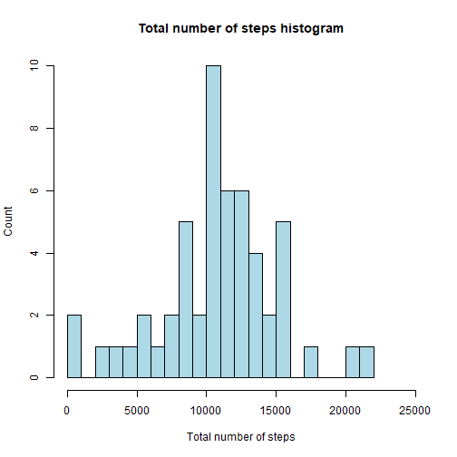
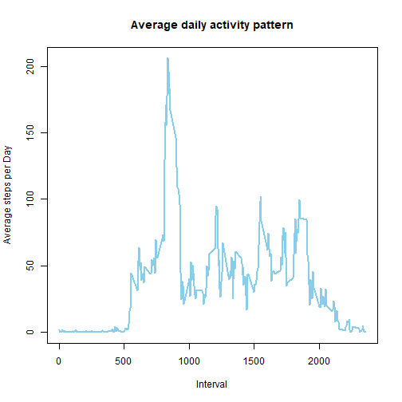
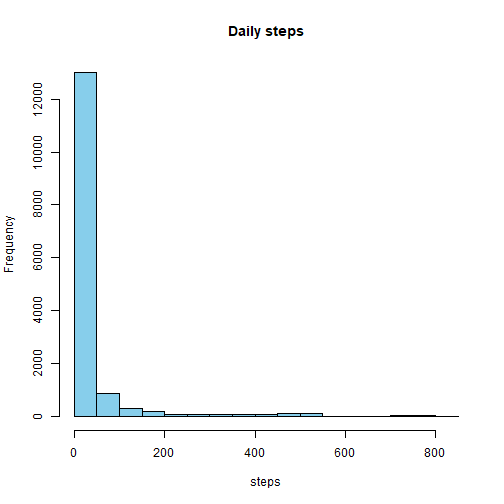
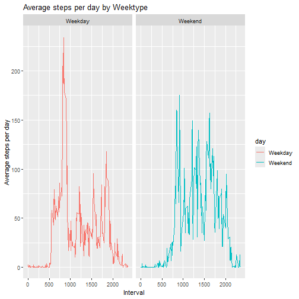

## Loading and preprocessing the data

``` r
# setwd(paste(getwd(),"/5. Reproducible Research/Project_1", sep = ""))
# getwd()
# list.files(getwd())
# unzip("repdata_data_activity.zip")
```
## Reading csv.file into df


``` r
df <- read.csv("activity.csv")
```


## What is mean total number of steps taken per day?

1. Calculate the total number of steps taken per day

``` r
Total_steps = tapply(df$steps, df$date, sum)
Total_steps = data.frame(date = names(Total_steps), total_steps = as.numeric(Total_steps))
head(Total_steps)
```

```
##         date total_steps
## 1 2012-10-01          NA
## 2 2012-10-02         126
## 3 2012-10-03       11352
## 4 2012-10-04       12116
## 5 2012-10-05       13294
## 6 2012-10-06       15420
```

2. If you do not understand the difference between a histogram and a barplot, research the difference between them. Make a histogram of the total number of steps taken each day. 

``` r
hist(Total_steps$total_steps, xlab = "Total number of steps", ylab = "Count", main = "Total number of steps histogram", col = "lightblue", breaks = 30, xlim = c(0, 25000))
```



3. Calculate and report the mean and median of the total number of steps taken per day

``` r
summary(Total_steps$total_steps, na.rm = TRUE)[3:4]
```

```
##   Median     Mean 
## 10765.00 10766.19
```

## What is the average daily activity pattern?
1. Make a time series plot (i.e. 𝚝𝚢𝚙𝚎 = "𝚕") of the 5-minute interval (x-axis) and the average number of steps taken, averaged across all days (y-axis)

``` r
daily_activity <- tapply(df$steps, df$interval, mean, na.rm = TRUE)
daily_activity <- data.frame(interval = names(daily_activity), average_steps = as.numeric(daily_activity))

with(daily_activity, plot(x = interval, y = average_steps, type = "l", col = "skyblue", lwd = 2, xlab = "Interval", ylab = "Average steps per Day", main = "Average daily activity pattern"))
```



2. Which 5-minute interval, on average across all the days in the dataset, contains the maximum number of steps?

``` r
daily_activity[which.max(daily_activity$average_steps),]
```

```
##     interval average_steps
## 104      835      206.1698
```

## Imputing missing values
1. Calculate and report the total number of missing values in the dataset (i.e. the total number of rows with 𝙽𝙰s)

``` r
sum(is.na(df))
```

```
## [1] 2304
```

2. Devise a strategy for filling in all of the missing values in the dataset. The strategy does not need to be sophisticated. (The mean for that 5-minute interval)

``` r
df_filled <- df

for (i in seq_along(df_filled$steps)) {
  if (is.na(df_filled$steps[i])) {
    current_interaval <- df_filled$interval[i]
    df_filled$steps[i] <- daily_activity$average_steps[match(current_interaval, daily_activity$interval)]
    
  }
}
```

3. Create a new dataset that is equal to the original dataset but with the missing data filled in.

``` r
head(df_filled)
```

```
##       steps       date interval
## 1 1.7169811 2012-10-01        0
## 2 0.3396226 2012-10-01        5
## 3 0.1320755 2012-10-01       10
## 4 0.1509434 2012-10-01       15
## 5 0.0754717 2012-10-01       20
## 6 2.0943396 2012-10-01       25
```

4. Make a histogram of the total number of steps taken each day and calculate and report the mean and median total number of steps taken per day. Do these values differ from the estimates from the first part of the assignment? What is the impact of imputing missing data on the estimates of the total daily number of steps?

``` r
hist(df$steps, xlab = "steps", main = "Daily steps", col = "skyblue")
```




``` r
t(data.frame(row.names = c("Median", "Mean"), WithNA = (as.numeric(summary(Total_steps$total_steps), na.rm = TRUE)[3:4]), WithoutNA = (as.numeric(summary(df$steps)[3:4]))))
```

```
##           Median       Mean
## WithNA     10765 10766.1887
## WithoutNA      0    37.3826
```

## Are there differences in activity patterns between weekdays and weekends?
1. Create a new factor variable in the dataset with two levels – “weekday” and “weekend” indicating whether a given date is a weekday or weekend day.

``` r
daily_activity2 <- df
daily_activity2$day <- weekdays(as.Date(daily_activity2$date))
daily_activity2$day <- ifelse(daily_activity2$day %in% c("Saturday", "Sunday"), "Weekend", "Weekday")
weektype_avg.steps <- tapply(daily_activity2$steps, list(daily_activity2$interval, daily_activity2$day), mean, na.rm = TRUE)

for (i in seq_along(daily_activity2$steps)) {
  current_interval <- as.character(daily_activity2$interval[i])
  if (daily_activity2$day[i] == "Weekday") {
    daily_activity2$avg_steps[i] <- weektype_avg.steps[current_interval, 1]
  } else if (daily_activity2$day[i] == "Weekend") {
  daily_activity2$avg_steps[i] <- weektype_avg.steps[current_interval, 2]
}
}
head(daily_activity2)
```

```
##   steps       date interval     day avg_steps
## 1    NA 2012-10-01        0 Weekday 2.3333333
## 2    NA 2012-10-01        5 Weekday 0.4615385
## 3    NA 2012-10-01       10 Weekday 0.1794872
## 4    NA 2012-10-01       15 Weekday 0.2051282
## 5    NA 2012-10-01       20 Weekday 0.1025641
## 6    NA 2012-10-01       25 Weekday 1.5128205
```

2. Make a panel plot containing a time series plot (i.e. 𝚝𝚢𝚙𝚎 = "𝚕") of the 5-minute interval (x-axis) and the average number of steps taken, averaged across all weekday days or weekend days (y-axis). See the README file in the GitHub repository to see an example of what this plot should look like using simulated data.

``` r
library(ggplot2)
ggplot(daily_activity2, aes(x = interval, y = avg_steps, colour = day))+geom_line()+facet_wrap(.~day)+labs(x = "Interval", y = "Average steps per day")+labs(title = "Average steps per day by Weektype")
```


